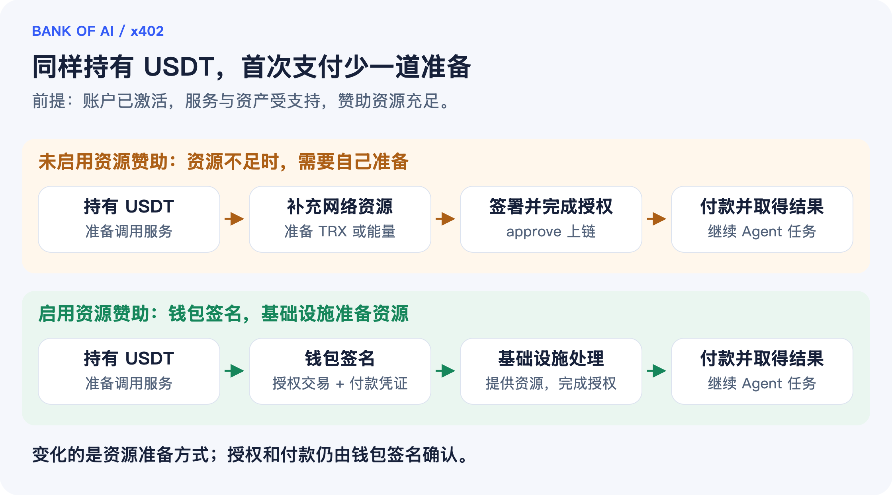
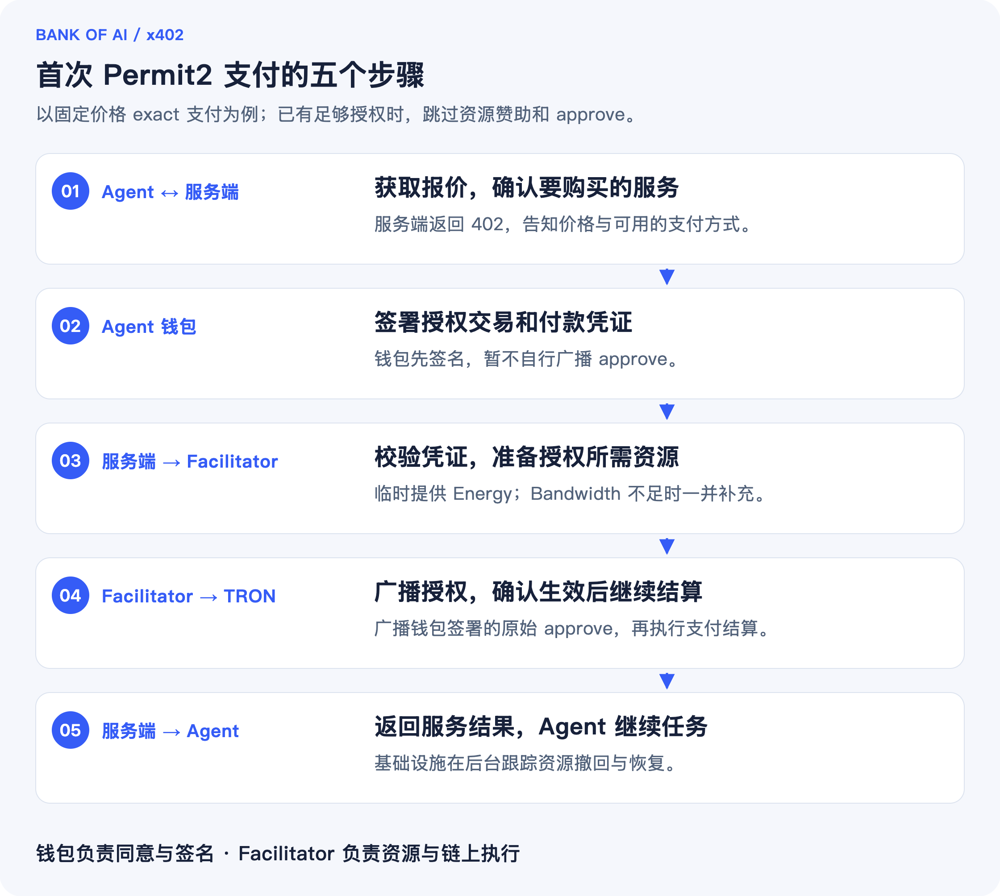
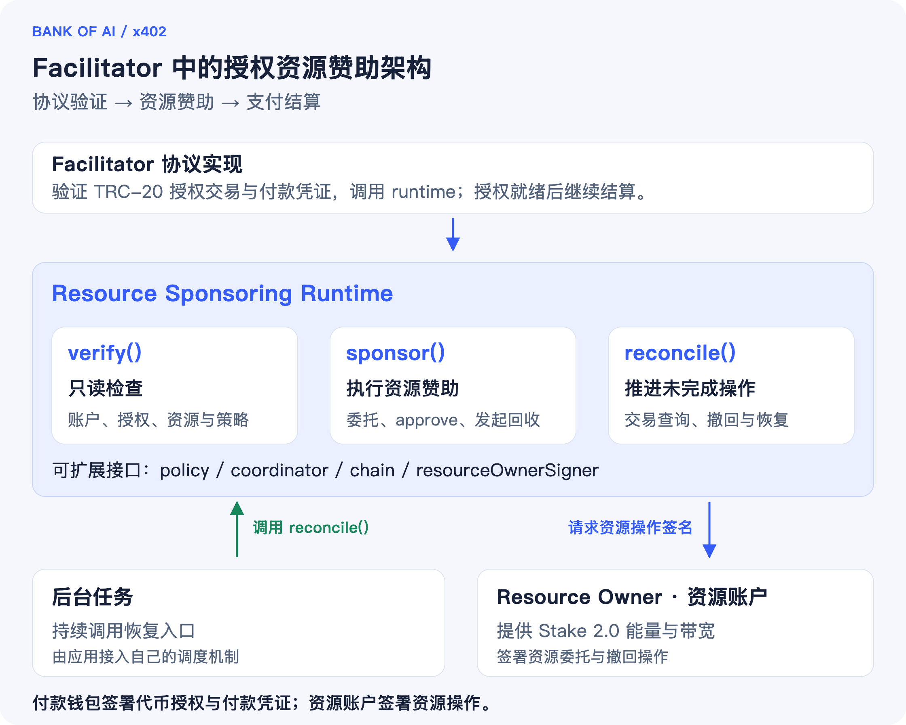

# 没有 TRX，x402 如何在 TRON 上完成首次 Permit2 支付？

在 TRON 上用 USDT 付款，第一步可能是先给 Permit2 做一次链上授权。这笔交易需要能量和带宽。对于只持有 USDT 的 Agent 钱包，支付往往就卡在这里。

TRC-20 授权资源赞助让服务方承担这次授权所需的资源，付款钱包无需预先持有 TRX。前提是账户已经激活，使用的代币和支付方案受支持，服务端与 Facilitator 已开启赞助，赞助方也有足够的资源和额度。账户激活仍需单独完成。

下面从首次支付讲起，再看 Facilitator 如何实现资源赞助。本文不涉及生产部署和安全评估，这部分请参阅 [Security considerations](https://github.com/BofAI/x402/blob/v1.2.0/specs/extensions/trc20_approval_resource_sponsoring.md#security-considerations)。

## 1. Agent 为什么会卡在首次支付？

假设一个研究 Agent 要购买一份 0.05 USDT 的数据。它的钱包已经激活，有 10 USDT、0 TRX，也从未授权过 Permit2。报价在预算内，但钱包缺少执行 approve 所需的能量和带宽，暂时还付不了款。

这里有两笔不同的开销：买数据花的是 USDT，执行链上授权消耗的是能量（Energy）和带宽（Bandwidth）。USDT 余额够用，并不能解决授权交易的资源问题。

如果由用户手动准备 TRX 或补充资源，Agent 就得停下来等。开启资源赞助后，Facilitator 可以在支付过程中安排资源，钱包仍负责签署授权交易和付款凭证。

## 2. Permit2 首次支付为什么需要 approve？

要通过 Permit2 支付，钱包需要先调用代币合约的 `approve`，给指定的 Permit2 合约设置代币使用额度。之后每次付款，钱包还要签署单独的付款凭证，约定金额、收款方等条件。

读流程时，需要区分以下几个概念：

| 概念 | 在流程中的含义 |
| --- | --- |
| TRC-20 授权 `approve` | 一笔链上交易，为指定的 Permit2 合约设置代币使用额度 |
| 授权额度 `allowance` | 代币合约记录的可用授权额度，用来判断是否还需要 approve |
| 付款凭证 | 钱包对本次支付条件的签名，例如金额、收款方与有效期 |
| 结算 | 根据有效的付款凭证执行链上付款或通道存款 |

approve 成功后，代币还没有付出去，要等结算完成才算付款成功。以后再调用服务，只要 allowance 足够，就不必重复 approve。

## 3. 授权资源赞助如何工作？

这项扩展在 SDK 中叫 `trc20ApprovalResourceSponsoring`。服务端通过 x402 支付要求告诉客户端：这次授权可以获得资源赞助。客户端发现需要 approve 时，会签好授权交易，连同付款凭证一起交给 Facilitator，不自行广播。

Facilitator 检查授权交易和付款凭证，再协调 **Resource Owner**（资源账户）向付款账户临时委托能量，必要时补充带宽。等资源可用，就广播钱包签好的原始 approve。确认 allowance 生效后，才继续结算。



*图 1：Facilitator 负责协调资源，付款钱包负责签署授权交易和付款凭证。*

Resource Owner 的资源来自 Stake 2.0 质押。它把资源使用额度委托给付款账户，质押本金仍留在自己名下。这里的 Resource Owner 指提供链上资源的账户，提供数据或模型服务的业务服务端则叫 Resource Server。

授权完成后，Facilitator 会发起资源撤回，尚未完成的撤回和恢复由后台继续处理，付款结算不必等它结束。赞助方承担了资源成本，因此会自行设定支持哪些资产、赞助多少额度等条件。

## 4. 五步支付流程与 0.05 USDT 案例

回到前面购买数据的例子。使用 `exact` 固定金额付款时，从 Agent 发起请求到拿到数据，流程如下：



*图 2：客户端沿用 x402 请求流程，不需要另行调用资源准备接口。*

Agent 接受 0.05 USDT 的报价，服务方按约定赞助首次授权所需的资源。假设没有额外代币费用，也没有其他并发交易，成功付款后，钱包和请求的状态会这样变化：

| 项目 | 支付前 | 授权与结算成功后 |
| --- | --- | --- |
| 付款账户 USDT | 10 USDT | 9.95 USDT |
| 付款账户 TRX | 0 TRX | 0 TRX，授权资源由赞助方提供 |
| Permit2 allowance | 0，需要 approve | 已建立，后续付款时检查剩余额度即可 |
| 付款凭证 | 本次调用尚未签署 | 已签署，并用于本次 0.05 USDT 结算 |
| 数据结果 | 尚未取得 | 已返回，Agent 继续任务 |

*上表为流程示例，未经实测；实际费用以服务方说明为准。*

## 5. 支持范围与使用条件

这个扩展用于以下三种 TRON Permit2 支付方案中的 approve：

| 支付方案 | 资源赞助作用的位置 |
| --- | --- |
| `exact` | 固定金额付款需要 approve 时 |
| `upto` | 授权支付上限、后续按实际金额结算的路径需要 approve 时 |
| `batch-settlement` | Permit2 通道存款或补款需要 approve 时；后续 Voucher、Claim 等操作不重复使用本扩展 |

目前支持的付款账户是已激活、使用默认 owner 权限的单签普通账户。接入时，客户端要能签署扩展要求的交易，服务端和 Facilitator 也要支持同一组网络、资产和支付方案。`exact_gasfree` 使用另外的 GasFree 账户与中继流程，不在这里讨论的范围内。

SDK v1.2.0 的 approve 会向指定的 canonical Permit2 授予 `MaxUint256` 额度，每笔付款或存款仍需单独签名。默认的 `zero-first` 策略适用于 allowance 为零的账户。如果已有额度但不足以支付，需要按代币的授权规则另行处理，详见[扩展规范](https://github.com/BofAI/x402/blob/v1.2.0/specs/extensions/trc20_approval_resource_sponsoring.md)。

## 6. Facilitator 架构与精简注册示例

在 Facilitator 内，协议层负责检查授权交易和付款凭证，资源赞助的具体执行交给 runtime。runtime 负责安排资源、广播 approve、跟踪执行结果；Resource Owner 提供资源，并签署委托和撤回交易。授权完成后，再由对应的支付方案执行结算。



*图 3：runtime 连接支付流程、资源账户和后台恢复任务。*

| runtime 入口 | 职责 |
| --- | --- |
| `verify()` | 只读检查账户、allowance、资源需求与赞助条件，不委托资源、不广播交易 |
| `sponsor()` | 预留并委托资源，广播原始 approve，确认授权生效，记录并发起回收 |
| `reconcile()` | 由后台任务调用，处理结果未知的交易以及未完成的资源撤回与恢复 |

下面的**装配骨架**展示了 runtime 如何注册到 Facilitator。运行前还需要补齐 `network`、签名器、协调器、资产地址和权限配置：

```typescript
import { x402Facilitator } from "@bankofai/x402-core/facilitator";
import { createTrc20ApprovalResourceSponsoringExtension } from "@bankofai/x402-extensions";
import { createTrc20ResourceSponsoringRuntime } from "@bankofai/x402-tron";
import { ExactTronScheme } from "@bankofai/x402-tron/exact/facilitator";

const runtime = await createTrc20ResourceSponsoringRuntime({
  network, resourceOwnerSigner, coordinator,
  allowedAssets: [usdtAddress], permissionId,
});
const facilitator = new x402Facilitator()
  .register(network, new ExactTronScheme(settlementSigner))
  .registerExtension(
    createTrc20ApprovalResourceSponsoringExtension(runtime),
  );
// 另由后台任务持续调用 runtime.reconcile()。
```

自托管时，可以按需要替换赞助策略 `policy`、资源协调器 `coordinator`、链交互层 `chain` 和资源账户签名器 `resourceOwnerSigner`。持久化、恢复、远程签名与 HSM 接入见 [SDK Facilitator 接入文档](https://github.com/BofAI/x402/blob/v1.2.0/typescript/packages/extensions/src/trc20-approval-resource-sponsoring/README.md#facilitator)与[模块接口](https://github.com/BofAI/x402/blob/v1.2.0/typescript/packages/mechanisms/tron/src/resource-sponsoring/types.ts)。多资源池调度和第三方能量供应商接入则需要自行实现。

## 7. Nile 体验与自托管入口

BANK OF AI 后续会在其运营的 Official Facilitator 上支持 TRON Nile 首次 Permit2 授权资源赞助。开放后，可以直接接入官方服务试一次完整支付，由官方准备授权资源，无需自己准备资源账户或部署 runtime。

### 通过官方 Nile 服务体验

接入方式见 [Official Facilitator 文档](https://docs.bankofai.io/zh-Hans/x402/core-concepts/OfficialFacilitator/)。Nile 赞助开放后，可以按以下步骤体验：

1. 准备一个已激活、尚未授权 Permit2 的 Nile 钱包，转入官方支持的测试代币。
2. 将业务服务端接入 Official Facilitator，在支持的 TRON Permit2 路由上声明资源赞助扩展，客户端使用支持该扩展的 SDK。
3. 发起请求并签名，观察 approve 生效、付款结算和服务返回结果的过程。

满足赞助条件时，付款钱包无需预先准备 TRX。开放时间、支持的测试代币和赞助额度，以官方服务说明为准。

### 开发自己的 Facilitator

如果要自己管理资源账户和赞助策略，可以按 [SDK Facilitator 接入说明](https://github.com/BofAI/x402/blob/v1.2.0/typescript/packages/extensions/src/trc20-approval-resource-sponsoring/README.md#facilitator)，在 Nile 配置 Resource Owner 和 runtime。

首次授权、付款和资源回收该怎么验证，可以参考[公开的 Nile 集成测试源码](https://github.com/BofAI/x402/blob/v1.2.0/typescript/packages/mechanisms/tron/test/integrations/trc20-approval-resource-sponsoring.nile.test.ts)，在自己的环境中运行检查。

## 8. 开发者参考

本文基于 BANK OF AI x402 SDK **v1.2.0**，对应 `@bankofai/x402-tron@1.2.0` 与 `@bankofai/x402-extensions@1.2.0`。接口与支持范围见 [v1.2.0 发布说明](https://github.com/BofAI/x402/releases/tag/v1.2.0)。

- [BANK OF AI x402：面向 AI 智能体的稳定币支付方案](https://docs.bankofai.io/zh-Hans/devnotes/x402-stablecoin-payments-for-agents/)：协议背景与支付方案。
- [TRC-20 Approval Resource Sponsoring 规范](https://github.com/BofAI/x402/blob/v1.2.0/specs/extensions/trc20_approval_resource_sponsoring.md)：支持范围与授权约束。
- [SDK 接入说明](https://github.com/BofAI/x402/blob/v1.2.0/typescript/packages/extensions/src/trc20-approval-resource-sponsoring/README.md)：客户端、服务端和 Facilitator 接入。
- [Security considerations](https://github.com/BofAI/x402/blob/v1.2.0/specs/extensions/trc20_approval_resource_sponsoring.md#security-considerations)：生产安全评估需要考虑的协议边界。
