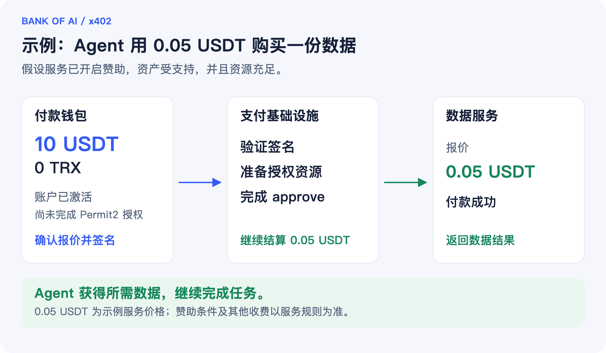

# 有 USDT，没有 TRX，Agent 如何完成第一笔支付？

**BANK OF AI x402 授权资源赞助，让 Agent 少做一步准备，更顺畅地开始使用付费服务。**

一个 AI Agent 正在做研究。它找到了一份需要付费的数据，价格合适，钱包里的 USDT 也足够。但付款时，它却停了下来：还没完成代币授权，账户又没有足够的网络资源。

为了继续任务，用户可能得先补充 TRX，或者准备能量。原本只是想买一份数据，却多了一段准备工作。

BANK OF AI x402 的 **TRC-20 Approval Resource Sponsoring（代币授权资源赞助）**，就是为了解决这个问题：在满足支持条件时，由支付基础设施提供首次授权所需的资源，让付款钱包无需预先持有 TRX。

## 1. 为什么有 USDT，还可能付不了款？

可以把这类支付理解为两件事：**给支付合约代币使用权限，以及确认本次要付多少钱。**

第一次通过 Permit2 支付时，钱包通常需要先完成 `approve`。它的意思是“允许指定合约使用我的代币”。这一步需要在 TRON 链上执行，会消耗能量（Energy）和带宽（Bandwidth）。

USDT 是付款用的资产，能量和带宽是执行链上操作需要的资源。因此，USDT 余额充足，并不一定代表首次授权已经具备执行条件。


*图 1：用户仍然需要签名同意，基础设施接手了授权资源的准备工作。*

## 2. 资源赞助，帮 Agent 做了什么？

x402 让服务在 HTTP 请求中直接告诉 Agent：“这项服务多少钱，接受什么方式付款。”Agent 接受条件后签署付款凭证，再取得服务。[参考：BANK OF AI x402 稳定币支付方案](https://docs.bankofai.io/zh-Hans/devnotes/x402-stablecoin-payments-for-agents/)。

资源赞助在这套流程中补上了首次授权这一步。钱包先签好授权交易，支付执行服务 **Facilitator** 验证后，临时向付款账户提供所需的能量，并在带宽不足时补充带宽。等资源可用，再把钱包签好的授权交易提交上链。

授权生效后，支付继续进行。资源的撤回和恢复由基础设施跟进，Agent 可以继续原本的任务。

**钱包负责“同意支付”，基础设施负责“准备资源并执行”。** 私钥始终由付款钱包管理。

## 3. 一次完整的首次支付，分五步完成

下面以购买一项固定价格服务为例。读图时，只需要关注两个问题：谁在签名，谁在准备资源。


*图 2：资源赞助接入现有 x402 请求流程，客户端不需要另行调用资源准备接口。*

这里有两个容易混淆的地方：

- **授权不等于已经付款。** approve 完成后，还需要依据本次付款凭证执行结算。
- **资源赞助不需要每笔重复。** 后续付款只要授权额度仍然足够，就可以跳过资源赞助和 approve。

资源撤回会在授权生效后尽快发起，确认和恢复可在后台继续，不必等全部回收完成才推进付款。

## 4. 看一个具体例子：花 0.05 USDT 获取数据

假设一个研究 Agent 的 TRON 钱包已经激活，里面有 10 USDT、没有 TRX，也还没给 Permit2 授权。它想购买一份报价为 0.05 USDT 的数据。

服务支持资源赞助，资产在支持范围内，Facilitator 也有足够资源。Agent 确认价格在预算内，钱包签署授权交易和付款凭证，后续资源准备、授权上链和结算便沿着同一套支付流程完成。



*图 3：示例金额用于说明流程，实际赞助条件和费用以服务公开规则为准。*

对 Agent 来说，它可以继续获取数据、分析内容、完成报告。对服务提供方来说，这减少了用户首次付款时额外准备 TRX 或能量的操作。

同样的能力，也能用于不同的业务：

| 想提供的服务 | 对应支付方式 | 资源赞助何时发挥作用 |
| --- | --- | --- |
| 一份报告、一次查询 | `exact`：固定金额付款 | Permit2 付款需要补齐授权时 |
| 按实际用量收费的推理服务 | `upto`：先设上限，再按实际结算 | Permit2 付款需要补齐授权时 |
| 连续检索、多轮工具调用 | `batch-settlement`：批量结算 | 向通道存款或补款需要 Permit2 授权时 |

## 5. 开发者接入：runtime 如何把资源赞助跑起来？

从开发者的角度看，资源赞助可以拆成三个部分：**扩展传递信息，runtime 执行流程，Resource Owner 提供资源。**

服务端通过 `trc20ApprovalResourceSponsoring` 扩展声明能力，客户端 SDK 把签好的 approve 放进支付请求。Facilitator 中的协议实现验证交易与付款凭证，再交给 runtime 处理资源赞助。授权准备好以后，由相应的支付方案继续结算。

### 5.1 runtime：把一次赞助从开始管到结束

runtime 是运行在 Facilitator 一侧的资源赞助执行模块。它协调“检查、预留、委托、广播、回收”这几个环节，让开发者不必从头编排这些链上操作。


*图 4：SDK 提供流程与接口，部署方接入自己的存储、资源账户、签名服务和后台任务。*

可以通过三个入口理解 runtime 的工作：

| 入口 | 通俗理解 | 主要工作 |
| --- | --- | --- |
| `verify()` | 先看这笔赞助能不能做 | 检查账户、余额、现有授权和资源需求，评估赞助策略；不委托资源、不广播交易 |
| `sponsor()` | 把授权需要的资源准备好 | 预留容量和预算，委托资源，确认资源到账，广播原始 approve，确认授权生效，并记录和发起资源回收 |
| `reconcile()` | 把没完成的事情继续处理 | 查询结果未知的交易，推进资源撤回与恢复；需要由部署方在启动后及后台定期调用 |

执行过程中，runtime 会估算这次 approve 需要多少能量和带宽，根据账户已有资源计算缺口，再加上配置的安全余量和上限。Resource Owner 自己发送委托、撤回交易所需的带宽，也会纳入计划。

链上交易发出前，系统先保存已签交易和交易 ID。遇到超时，可以查询原交易的状态，避免把“暂时不知道结果”当成“没有执行过”。这也是生产环境需要持久化存储的原因。

**runtime 成功完成赞助，表示授权环节已准备好；本次付款是否成功，还要看后续支付结算结果。** 即使请求中断或付款失败，已经委托出去的资源仍需要继续回收。

### 5.2 Resource Owner：资源从哪里来？

Resource Owner 是持有可委托资源的 TRON 账户。它通过 Stake 2.0 质押 TRX，获得能量或带宽，并在需要时把资源使用额度临时委托给付款账户。质押与资源的基本关系可参考 [TRON 资源模型](https://developers.tron.network/docs/resource-model)。

这里委托的是资源使用额度，质押本金仍属于 Resource Owner，付款账户不会因此收到一笔可自由转走的 TRX。

它与另外两个角色各有分工：

- **付款钱包**持有 USDT，签署代币授权和付款凭证。
- **Resource Owner**提供能量、带宽，并签署资源委托与撤回交易。
- **Facilitator**协调执行，并通过对应的支付方案推进结算。

提供数据或模型的业务服务端通常称为 Resource Server；它与这里提供链上能量、带宽的 Resource Owner 是两个不同的角色。

资源账户可以由平台自己运营，也可以由独立的资源运营方管理，再通过签名接口接入。当前签名边界是 `resourceOwnerSigner`：它提供账户地址，并根据明确的资源操作意图签名。这个意图包含网络、接收账户、资源类型、委托数量，以及“委托还是撤回”。

因此，开发者可以为兼容的远程钱包或 HSM 编写适配器，让资源密钥留在已有的签名系统中。当前实现要求使用授权委托和撤回操作的非 owner Active Permission，并在签名前核对操作意图与实际交易。资源账户与结算账户也可以分开管理，分别维护权限和预算。

资源回收还有一个要点：**撤回委托，不代表已经消耗的能量立刻恢复。** runtime 会继续跟踪可用容量，确认恢复后再释放预留额度，避免同一份资源被过早重复分配。

### 5.3 哪些模块可以按业务扩展？

SDK 提供默认实现和明确的接口。可以先采用默认的链上执行流程，再按业务需要替换其中的模块。

| 模块 | 负责什么 | 可以怎样扩展 |
| --- | --- | --- |
| 赞助策略 `policy` | 决定这笔请求是否值得赞助 | 接入客户额度、活动补贴或成本上限；SDK 已提供网络、资产白名单等静态策略 |
| 协调器 `coordinator` | 保存进度，预留容量和预算，防止重复执行 | 使用自建数据库实现持久化与多实例协调，让多个 Facilitator 共享同一份状态 |
| 链上适配器 `chain` | 查询、模拟、准备交易、广播和确认 | 适配自有 RPC、节点访问方式和确认策略，同时保持相同的资源与交易校验规则 |
| 签名器 `resourceOwnerSigner` | 为资源委托和撤回签名 | 接入兼容的远程钱包或 HSM，并按资源操作意图限制签名范围 |
| 恢复任务 | 调用 `reconcile()`，持续处理未完成操作 | 接入现有任务调度、监控和告警系统，跟踪撤回失败与长时间未恢复的容量 |

策略模块做“是否允许”的判断，协调器负责把预算和容量的预留原子地落库。两者配合，才能避免多个并发请求各自通过检查，却共同超出预算。

SDK 提供的 `InMemoryTrc20SponsoringCoordinator` 适合测试和单进程开发。生产数据库、跨实例互斥与后台调度需要部署方实现，不能只换一个数据库连接字符串就认为已经完成生产接入。

如果以后需要管理多个 Resource Owner，可以进一步开发资源池选择和调度层；同一笔赞助的委托、回收和恢复必须始终绑定原来的资源账户。第三方能量供应商也需要额外的适配与履约检查。**这些是可建设的扩展方向，当前 SDK 没有内置完整的多资源池调度或能量供应商市场。**

### 5.4 从默认 runtime 开始接入

常规接入可以使用高层工厂函数 `createTrc20ResourceSponsoringRuntime()`。下面展示关键装配方式，其中资源签名器、持久化协调器和支付签名器由部署方提供：

```typescript
import { x402Facilitator } from "@bankofai/x402-core/facilitator";
import {
  createTrc20ApprovalResourceSponsoringExtension,
} from "@bankofai/x402-extensions";
import {
  createTrc20ResourceSponsoringRuntime,
} from "@bankofai/x402-tron";
import { ExactTronScheme } from "@bankofai/x402-tron/exact/facilitator";

const runtime = await createTrc20ResourceSponsoringRuntime({
  network,
  resourceOwnerSigner,             // 资源账户的受限签名器
  coordinator: durableCoordinator, // 部署方实现的持久化协调器
  allowedAssets: [usdtAddress],
  permissionId: resourcePermissionId, // 账户实际配置的 Active Permission
});

const facilitator = new x402Facilitator()
  .register(network, new ExactTronScheme(settlementSigner))
  .registerExtension(
    createTrc20ApprovalResourceSponsoringExtension(runtime),
  );

// 在服务启动后执行，并接入持续运行的后台恢复任务。
await runtime.reconcile();
```

如果需要注入自定义 `policy` 或 `chain`，可以使用底层工厂函数 `createTrc20ApprovalResourceSponsoringRuntime({ chain, coordinator, policy, ... })`。两层入口分别服务于常规配置和深度定制。

授权策略也需要与代币行为一致。默认的 `zero-first` 策略适用于当前授权额度为零的情况；如果额度非零但仍不足，会返回 `approval_reset_required`，不会自动插入一笔清零授权。只有确认代币支持直接覆盖时，才应显式配置 `direct-overwrite`。

完成 Facilitator 配置后，还需要在业务路由声明赞助能力，并让客户端使用支持该扩展的 SDK。首次授权涉及多笔链上交易，HTTP 超时和签名有效期也应覆盖整段流程。建议先在 Nile 跑通首次付款、重复请求和中断后的恢复，再接入实际业务。

## 6. 使用前需要满足哪些条件？

使用时，需要满足几个基本条件：

- **账户已激活。** 当前版本面向使用默认 owner 权限的单签普通账户，不包含账户激活。
- **服务与资产受支持。** 服务端和 Facilitator 需要启用赞助，并有可用资源与赞助额度。
- **钱包同意授权。** 当前版本会向指定的 Permit2 合约授予高额度授权（`MaxUint256`），产品应明确展示授权对象与额度；每笔付款仍需相应的签名凭证。

无需预备 TRX，意味着资源由赞助方安排，网络成本仍然存在。这项能力走普通账户的 Permit2 路径，与 `exact_gasfree` 的 GasFree 账户和中继路径不同。

项目 2026 年 8 月 27 日的 Nile 测试记录显示，上述三类路径完成了端到端验证，测试中付款账户的 TRX 余额保持不变。这是历史测试结果，不代表当前托管服务或主网已开放全部能力；具体可用范围以实际部署和发布说明为准。

**让 Agent 把预算用在需要的数据、模型和工具上，让支付基础设施处理首次授权所需的资源。**

从 [BANK OF AI x402 文档](https://docs.bankofai.io/zh-Hans/devnotes/x402-stablecoin-payments-for-agents/) 开始，了解如何把稳定币支付接入你的 Agent 服务。

## 开发者参考

本文的 runtime 接口与支持范围按 SDK 仓库版本 `e50e9f0` 核对；实际接入时，请使用包含上述接口的 SDK 版本。

- [扩展规范与支持范围](https://github.com/BofAI/x402/blob/e50e9f09149203a97e35110ee1cd64073487f30d/specs/extensions/trc20_approval_resource_sponsoring.md)。
- [SDK 接入说明与生产运行要求](https://github.com/BofAI/x402/blob/e50e9f09149203a97e35110ee1cd64073487f30d/typescript/packages/extensions/src/trc20-approval-resource-sponsoring/README.md)。
- [runtime 的模块接口](https://github.com/BofAI/x402/blob/e50e9f09149203a97e35110ee1cd64073487f30d/typescript/packages/mechanisms/tron/src/resource-sponsoring/types.ts)。
